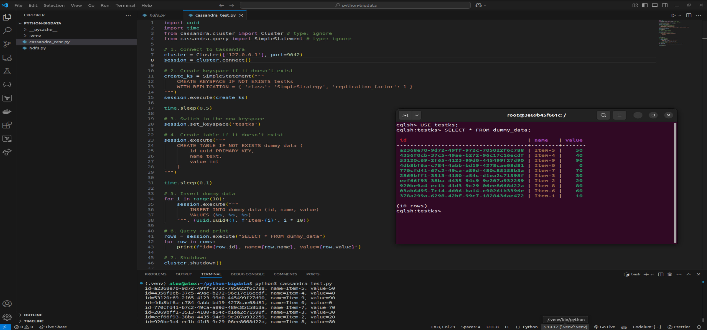

# Hybrid Real-Time Crypto Market Analytics

Author: Aleksander Pulla

Date: 03/21/2025

<br>

### Table of Contents

1. [Introduction](#introduction)
    - [Solution Architecture](#solution-architecture)
2. [Prerequisites](#prerequisites)
3. [Implementation](#implementation)
   - [Ingestion (Kafka)](#ingestion-kafka)
     - [Cluster Deployment](#cluster-deployment-kafka)
     - [Data Ingestion](#data-ingestion-kafka)
   - [Processing (Spark Streaming)](#processing-spark-streaming)
     - [Cluster Deployment](#cluster-deployment-spark)
     - [Data Processing](#data-processing-spark)
   - [Analysis (Cassandra)](#analysis-cassandra)
     - [Cluster Deployment](#cluster-deployment-cassandra)
     - [Data Analysis](#data-analysis-cassandra)
   - [Archival (HDFS)](#archival-hdfs)
     - [Cluster Deployment](#cluster-deployment-hdfs)
     - [Data Archival](#data-archival-hdfs)
4. [Conclusions](#conclusions)
    - [Key Considerations](#key-considerations)

<br>

# Introduction

In an era where data-driven decisions are revolutionizing industries, mastering the tools of the Hadoop ecosystem becomes not just advantageous, but imperative. This hands-on project showcases the power and flexibility of the Hadoop ecosystem, particularly focusing on its crucial role in real-time cryptocurrency market analytics. By leveraging Apache Kafka for data ingestion, Apache Spark Streaming for instantaneous processing, Cassandra for rapid analytics, and Hadoop's HDFS for efficient archival, this hybrid solution demonstrates a cost-effective integration between cloud and on-premises infrastructures. Through this hands-on project, you'll explore how each component within the Hadoop ecosystem collaboratively addresses the complexities and immense scale of real-time Big Data analytics — transforming vast streams of cryptocurrency market data into actionable insights.

<br>

## Solution Architecture

This section outlines a robust, hybrid architecture designed specifically for real-time crypto market analytics. It leverages the powerful capabilities of the Hadoop ecosystem components deployed across both AWS cloud and on-premises infrastructure. In this architecture, real-time cryptocurrency market data from Binance streams continuously into a Kafka cluster, coordinated by Apache Zookeeper for reliability. Apache Spark Streaming processes this incoming data instantly, performing real-time transformations and analytics to deliver immediate insights. Processed data is then simultaneously routed to Cassandra for rapid querying and interactive analysis, while historical data and long-term storage requirements are handled by Hadoop’s HDFS cluster, enabling cost-effective archival and durable storage.


<br>

# Prerequisites

- **Docker & Docker Compose:** Ensure both are installed and functional for container-based deployments.
- **Sufficient System Resources:** Allocate enough CPU, RAM, and storage to run multiple containers (e.g., Cassandra nodes, HDFS cluster, Zookeeper, Kafka brokers, and Spark workers).
- **AWS Account :** Required for the hybrid architecture (EC2, EBS, Site-to-Site VPN, etc.)
- **Networking & Firewall Rules:** Confirm ports for Kafka, Spark, Cassandra, and HDFS are open and accessible among containers.
- **Basic Big Data Knowledge:** Familiarity with Hadoop ecosystem, distributed systems, and container orchestration will help in troubleshooting and scaling.

<br>

# Implementation

This section details the practical implementation steps required to deploy the hybrid real-time cryptocurrency market analytics architecture. It is divided into four core subsections: **"Ingestion (Kafka)"** describes real-time streaming from the Binance API to Kafka; **"Processing (Spark Streaming)"** outlines the real-time processing and transformation of data; **"Analysis (Cassandra)"** explains how processed data is analyzed in Cassandra; and **"Archival (HDFS)"** covers the storage and archival of historical data within HDFS.

<br>

## Ingestion (Kafka)

This subsection describes the initial ingestion phase of the solution, where real-time market data from the Binance API is streamed into a Kafka cluster. Kafka acts as a highly scalable and fault-tolerant messaging system, reliably capturing and temporarily storing streaming data, enabling downstream real-time processing.

<a id="cluster-deployment-kafka"></a> 
### Cluster Deployment

In this part, the deployment of a Kafka cluster using Docker Compose is detailed. The cluster is composed of two Kafka brokers coordinated by a Zookeeper instance. Zookeeper facilitates node coordination, state synchronization, and workload management across Kafka brokers. Each Kafka broker is deployed within Docker containers configured for scalability, reliability, and ease of management. 
From the `docker-compose.yml` file below we are indicating that the cluster will leverage Confluent's official Docker images (`cp-zookeeper:7.6.1` and `cp-kafka:7.6.1`) for enhanced stability and reliability. Zookeeper is configured to run on port `2181`, providing distributed coordination for Kafka brokers. Two Kafka brokers (`kafka1` and `kafka2`) depend explicitly on Zookeeper for synchronization and metadata management, ensuring high availability and fault tolerance. Each Kafka broker exposes distinct ports (`9092` and `9093`) to prevent conflicts and includes specific configurations to ensure data durability, consistency, and replication across brokers. This streamlined setup enables efficient real-time data ingestion and scalable event-driven architectures.

```yaml
services:
  zookeeper:
    image: confluentinc/cp-zookeeper:7.6.1
    hostname: zookeeper
    container_name: zookeeper
    ports:
      - "2181:2181"
    environment:
      ZOOKEEPER_CLIENT_PORT: 2181
      ZOOKEEPER_TICK_TIME: 2000
    networks:
      kafka-net:

  kafka1:
    image: confluentinc/cp-kafka:7.6.1
    hostname: kafka1
    container_name: kafka1
    depends_on:
      - zookeeper
    ports:
      - "9092:9092"
    environment:
      KAFKA_BROKER_ID: 1
      KAFKA_ZOOKEEPER_CONNECT: zookeeper:2181
      KAFKA_ADVERTISED_LISTENERS: PLAINTEXT://kafka1:29092,PLAINTEXT_HOST://localhost:9092
      KAFKA_LISTENER_SECURITY_PROTOCOL_MAP: PLAINTEXT:PLAINTEXT,PLAINTEXT_HOST:PLAINTEXT
      KAFKA_INTER_BROKER_LISTENER_NAME: PLAINTEXT
      KAFKA_OFFSETS_TOPIC_REPLICATION_FACTOR: 2
      KAFKA_TRANSACTION_STATE_LOG_REPLICATION_FACTOR: 2
      KAFKA_TRANSACTION_STATE_LOG_MIN_ISR: 1
    networks:
      kafka-net:

  kafka2:
    image: confluentinc/cp-kafka:7.6.1
    hostname: kafka2
    container_name: kafka2
    depends_on:
      - zookeeper
    ports:
      - "9093:9092"
    environment:
      KAFKA_BROKER_ID: 2
      KAFKA_ZOOKEEPER_CONNECT: zookeeper:2181
      KAFKA_ADVERTISED_LISTENERS: PLAINTEXT://kafka2:29093,PLAINTEXT_HOST://localhost:9093
      KAFKA_LISTENER_SECURITY_PROTOCOL_MAP: PLAINTEXT:PLAINTEXT,PLAINTEXT_HOST:PLAINTEXT
      KAFKA_INTER_BROKER_LISTENER_NAME: PLAINTEXT
      KAFKA_OFFSETS_TOPIC_REPLICATION_FACTOR: 2
      KAFKA_TRANSACTION_STATE_LOG_REPLICATION_FACTOR: 2
      KAFKA_TRANSACTION_STATE_LOG_MIN_ISR: 1
    networks:
      kafka-net:

  python-streamer:
    image: python:3.10-slim
    container_name: python-streamer
    volumes:
      - ./python-kafka:/opt/app
    working_dir: /opt/app
    depends_on:
      - kafka1
      - kafka2
    command: >
      sh -c "pip install kafka-python websocket-client &&
             python main.py"
    restart: always         
    networks:
      kafka-net:

networks:
  kafka-net:
    driver: bridge
```

Once the `docker-compose.yml` file for Kafka cluster is defined, deploy the cluster and verify its existence via the following commands:

```bash
docker compose up -d
docker container ps
```


<a id="data-ingestion-kafka"></a> 

### Data Ingestion

After making sure that the Kafka cluster is successfully deployed, it is time to fetch real-time crypto market data and stream into Kafka. For such, we will use Binance’s WebSocketAPI in a Python application.

First, let’s install the required modules:

```bash
pip install websocket-client kafka-python
```

In order to stream real-time Binance trading data, define [`main.py`](http://main.py) file in your Python project directory as below.

```python
import websocket
import json
from kafka import KafkaProducer

producer = KafkaProducer(
    bootstrap_servers=['localhost:9092', 'localhost:9093'],
    value_serializer=lambda v: json.dumps(v).encode('utf-8')
)

topic = 'crypto-stream' 

def on_message(ws, message):
    data = json.loads(message)
    print(f"Sending data to Kafka: {data}")
    producer.send('crypto-stream', data)
    producer.flush()  # Force immediate send

def on_error(ws, error):
    print(f"Error: {error}")

def on_close(ws, close_status_code, close_msg):
    print("Closed connection to Binance.")

def on_open(ws):
    print("Connected to Binance WebSocket.")

if __name__ == "__main__":
    symbol = "btcusdt"  # Bitcoin/USD Tether pair
    binance_ws_url = f"wss://stream.binance.com:9443/ws/{symbol}@trade"

    ws = websocket.WebSocketApp(
        binance_ws_url,
        on_message=on_message,
        on_error=on_error,
        on_close=on_close,
        on_open=on_open
    )
    ws.run_forever()
```

Upon receiving each new trade event, the script immediately forwards the raw data into a Kafka cluster under the topic `crypto-stream`. Leveraging the Kafka producer client, the data is serialized into JSON format, ensuring reliable delivery to Kafka for downstream real-time processing and analytics

The moment the Python script is executed we can notice real-time data coming from Binance WebSocket API being published into Kafka topic (as indicated on the right-hand side by the in-built Kafka Consumer).


<br>

## Processing (Spark Streaming)

This subsection discusses how Spark Streaming consumes the incoming real-time data from the Kafka cluster, performing transformations and analytical computations. Apache Spark Streaming provides efficient processing through its in-memory, distributed processing framework, ensuring data is rapidly prepared for analytics and storage.

<a id="cluster-deployment-spark"></a> 

### Cluster Deployment

This part details the deployment of a Spark Streaming cluster, outlining the use of Docker Compose to instantiate multiple Spark worker nodes for parallel processing and a master node responsible for orchestrating the workload. Spark's efficient processing capabilities are leveraged to manage high-velocity data from Kafka efficiently. The deployment leverages the official Bitnami Spark Docker image (`bitnami/spark:3.5`) for reliable and streamlined configuration. The Spark Master container (`spark-master`) coordinates job scheduling and workload distribution, providing a web interface on port `8080` and accepting worker connections on port `7077`. Two worker nodes (`spark-worker-1` and `spark-worker-2`) register themselves with the master, each configured with dedicated computational resources (`2 vCPUs` and `4GB RAM`) for parallel, distributed processing. Workers expose individual web interfaces (`8081` and `8082`) for monitoring their resource utilization and job execution status. All components share a Docker bridge network (`spark-net`) to ensure secure internal communication, providing an efficient, scalable, and real-time capable data processing platform.

```yaml
services:
  spark-master:
    image: bitnami/spark:3.5
    container_name: spark-master
    ports:
      - "8080:8080"
      - "7077:7077"
    environment:
      - SPARK_MODE=master
    networks:
      - spark-net

  spark-worker-1:
    image: bitnami/spark:3.5
    container_name: spark-worker-1
    depends_on:
      - spark-master
    ports:
      - "8081:8081"
    environment:
      - SPARK_MODE=worker
      - SPARK_MASTER_URL=spark://spark-master:7077
      - SPARK_WORKER_CORES=2
      - SPARK_WORKER_MEMORY=4g
    networks:
      - spark-net

  spark-worker-2:
    image: bitnami/spark:3.5
    container_name: spark-worker-2
    depends_on:
      - spark-master
    ports:
      - "8082:8081"
    environment:
      - SPARK_MODE=worker
      - SPARK_MASTER_URL=spark://spark-master:7077
      - SPARK_WORKER_CORES=2
      - SPARK_WORKER_MEMORY=4g
    networks:
      - spark-net

networks:
  spark-net:
    driver: bridge
```

Once the `docker-compose.yml` file for Spark cluster is defined, deploy the cluster and verify its existence via the following commands:

```bash
docker compose up -d
docker container ps
```


Finally, when the cluster is up, we can check its successful deployment by opening Spark Master UI at `localhost:8080`


<a id="data-processing-spark"></a> 

### Data Processing

After the successful deployment of the Spark cluster, it is time to process real-time streaming data ingested by Kafka brokers.

Below is the pyspark code that reads the data from Kafka, processes it in micro-batches, transforms it and then writes it both to Cassandra (for further analytics) and HDFS as parquet files (for archival purposes):

```python
from pyspark.sql import SparkSession
from pyspark.sql.functions import from_json, col, from_unixtime
from pyspark.sql.types import StructType, StructField, StringType, LongType, BooleanType, DoubleType

spark = SparkSession.builder \
    .appName("KafkaSparkStreaming") \
    .master("spark://spark-master:7077") \
    .config("spark.cassandra.connection.host", "cassandra-1") \
    .config("spark.cassandra.connection.port", "9042") \
    .getOrCreate()

spark.sparkContext.setLogLevel("ERROR")

# -------------------------------------------------------------------
# 1) Define a schema for the JSON data
# -------------------------------------------------------------------
schema = StructType([
    StructField("event_type", StringType(), True),   
    StructField("E", LongType(), True),             
    StructField("s", StringType(), True),           
    StructField("p", StringType(), True),           
    StructField("q", StringType(), True),           
    StructField("T", LongType(), True),             
    StructField("M", BooleanType(), True)     
])

# -------------------------------------------------------------------
# 2) Read JSON from Kafka
# -------------------------------------------------------------------
kafka_df = (
    spark.readStream
         .format("kafka")
         .option("kafka.bootstrap.servers", "kafka1:29092,kafka2:29093")
         .option("subscribe", "crypto-stream")
         .option("startingOffsets", "latest")
         .load()
)

value_df = kafka_df.selectExpr("CAST(value AS STRING) as json_string")

parsed_df = value_df.select(from_json(col("json_string"), schema).alias("data"))

# -------------------------------------------------------------------
# 3) Alias each field from "data" individually 
# -------------------------------------------------------------------
alias_df = parsed_df.select(
    col("data.event_type").alias("event_type"),
    col("data.E").alias("binance_event_ms"),
    col("data.s").alias("symbol"),
    col("data.p").alias("price_str"),
    col("data.q").alias("quantity_str"),
    col("data.T").alias("binance_trade_ms"),
    col("data.M").alias("ignore_field")
)

# -------------------------------------------------------------------
# 4) Convert / rename for Cassandra table:
#    (symbol, event_time, price, quantity, trade_time,)
# -------------------------------------------------------------------
transformed_df = (
    alias_df
    .withColumn("event_time", from_unixtime(col("binance_event_ms") / 1000).cast("timestamp"))
    .withColumn("trade_time", from_unixtime(col("binance_trade_ms") / 1000).cast("timestamp"))
    .withColumn("price", col("price_str").cast("double"))
    .withColumn("quantity", col("quantity_str").cast("double"))
    .drop("event_type", "binance_event_ms", "binance_trade_ms", "price_str", "quantity_str", "ignore_field")
)

# -------------------------------------------------------------------
# 5) Write to Cassandra
# -------------------------------------------------------------------
def write_to_cassandra(batch_df, batch_id):
    batch_df.write \
        .format("org.apache.spark.sql.cassandra") \
        .mode("append") \
        .option("keyspace", "crypto_ks") \
        .option("table", "trades") \
        .save()

cassandra_query = (
    transformed_df
    .writeStream
    .foreachBatch(write_to_cassandra)
    .outputMode("append")
    .start()
)

# -------------------------------------------------------------------
# 6) Write to HDFS as Parquet (archival)
# -------------------------------------------------------------------
hdfs_query = (
    transformed_df
    .writeStream
    .format("parquet")
    .outputMode("append")
    .option("path", "hdfs://namenode:9000/crypto_data/trades")
    .option("checkpointLocation", "hdfs://namenode:9000/checkpoints/crypto_stream")
    .start()
)

# -------------------------------------------------------------------
# 7) Await termination
# -------------------------------------------------------------------
cassandra_query.awaitTermination()
hdfs_query.awaitTermination()
```

Once the script is ready, we trigger a spark job via the following command.

**NOTE: Make sure the defined table in Cassandra keyspace exists before starting a Spark job, otherwise it will not work**

```bash
spark-submit --master spark://spark-master:7077 --packages org.apache.spark:spark-sql-kafka-0-10_2.12:3.5.0,org.apache.kafka:kafka-clients:3.6.1,com.datastax.spark:spark-cassandra-connector_2.12:3.5.0 spark-streaming.py
```

Since its a real-time processing the application will run endlessly (awaiting for a termination from the client side), however below we can see some details coming from the Spark Master UI (how many workers are assigned within the cluster, running applications, duration of our spark job, etc.)

The `RUNNING` state of the application indicates that our spark job has been successful and error-free.


<br>

## Analysis (Cassandra)

This subsection describes how Cassandra is deployed and integrated within the architecture to analyze real-time processed data. The “Cluster Deployment” part details the setup of a two-node Cassandra cluster using Docker Compose, ensuring high availability and reliable data storage. After that, the “Analysis (Cassandra)” subsection provides the method for ingesting processed data from Spark Streaming into the Cassandra cluster for efficient querying and analytics.


<a id="cluster-deployment-cassandra"></a>

### Cluster Deployment

This part describes the deployment of a highly available, two-node Cassandra cluster using Docker Compose. The deployment begins by configuring the first Cassandra node (`cassandra-1`) using version `4.1`, explicitly defining the container's networking, RPC communication, cluster identification, and data-center specifics. Port `9042` is exposed to facilitate client connections, while port `7000` handles internal cluster communication. The second node (`cassandra-2`) subsequently joins this existing cluster, explicitly referencing the first node as its seed for initial synchronization and gossip communication. Both nodes leverage dedicated volumes (`./cassandra-1` and `./cassandra-2`) to persist data beyond container lifecycles. Additionally, each node is configured with comprehensive health checks (`nodetool status`) and automated restart policies (`on-failure`), ensuring resilience, reliability, and seamless recovery within the Cassandra cluster. 

```yaml
services:
  cassandra-1:
    image: "cassandra:4.1" 
    container_name: "cassandra-1"
    hostname: cassandra-1
    ports:
      - "7000:7000"
      - "9042:9042"
    networks:
      cassandra-net:
        ipv4_address: 172.30.0.10
    environment:
      - CASSANDRA_START_RPC=true       
      - CASSANDRA_RPC_ADDRESS=0.0.0.0  
      - CASSANDRA_LISTEN_ADDRESS=auto  
      - CASSANDRA_CLUSTER_NAME=cassandra-cluster
      - CASSANDRA_ENDPOINT_SNITCH=GossipingPropertyFileSnitch
      - CASSANDRA_DC=cassandra-datacenter
    volumes:
      - ./cassandra-1:/var/lib/cassandra:rw
    restart: on-failure
    healthcheck:
      test: ["CMD-SHELL", "nodetool status"]
      interval: 2m
      start_period: 2m
      timeout: 10s
      retries: 3

  cassandra-2:
    image: "cassandra:4.1"  
    container_name: "cassandra-2"
    hostname: cassandra-2
    ports:
      - "9043:9042"
    networks:
      cassandra-net:
        ipv4_address: 172.30.0.11
    environment:
      - CASSANDRA_START_RPC=true       
      - CASSANDRA_RPC_ADDRESS=0.0.0.0  
      - CASSANDRA_LISTEN_ADDRESS=auto  
      - CASSANDRA_CLUSTER_NAME=cassandra-cluster
      - CASSANDRA_ENDPOINT_SNITCH=GossipingPropertyFileSnitch
      - CASSANDRA_DC=cassandra-datacenter
      - CASSANDRA_SEEDS=cassandra-1
    depends_on:
      cassandra-1:
        condition: service_healthy
    volumes:
      - ./cassandra-2:/var/lib/cassandra:rw
    restart: on-failure
    healthcheck:
      test: ["CMD-SHELL", "nodetool status"]
      interval: 2m
      start_period: 2m
      timeout: 10s
      retries: 3

networks:
  cassandra-net:
    driver: bridge
    ipam:
      config:
        - subnet: 172.30.0.0/24
```

This configuration provides a robust foundation for deploying scalable, fault-tolerant Cassandra clusters effortlessly with Docker Compose.

Once the `docker-compose.yml` file for Cassandra cluster is defined, deploy the cluster and verify its existence via the following commands:

```bash
docker compose up -d
docker container ps
```


In the image below, you can see a Python script on the left, which connects to the deployed Cassandra cluster using the Cassandra driver. The script first creates a new keyspace—essentially a logical container for tables—and then defines and creates a table named `dummy_data`. Next, it inserts several rows of sample information, demonstrating how to store data in Cassandra programmatically. On the right, the terminal running `cqlsh` confirms that the data has indeed been inserted, hence validating successful deployment and operation of the Cassandra cluster.



<a id="data-analysis-cassandra"></a>

### Data Analysis

In above sections we have talked about Spark and the successful processing of it. However, before running Spark, it is very important to first create the keyspace in Cassandra, and then define the schema table according to the data we get from Kafka that ingests from Binance WebSocket API.

The DDL below indicates the creation of `crypto_ks` keyspace into Cassandra with replication factor 2 (since we have 2 Cassandra nodes and aim High Availability). Furthermore, we create `trades` table with all the columns that will be mapped with the data format coming from Kafka (processed via Spark), define a composite key, as well as CLUSTERING for sorting purposes.

```sql
CREATE KEYSPACE IF NOT EXISTS crypto_ks
WITH REPLICATION = {'class': 'SimpleStrategy', 'replication_factor': 2};

CREATE TABLE IF NOT EXISTS crypto_ks.trades (
    symbol text,
    event_time timestamp,
    price double,
    quantity double,
    trade_time timestamp,
    PRIMARY KEY (symbol, trade_time)
) WITH CLUSTERING ORDER BY (trade_time DESC);
```

Recalling the successful Spark job operation, we can see the data being processed into Cassandra as following.


This data can then be used for analytics purposes regarding the existing trades, discover potential trading patterns, asset behavior and fluctuations during specific period of times, etc.

<br>

## Archival (HDFS)

This subsection focuses on how to store and manage data long-term using the Hadoop Distributed File System (HDFS). HDFS is ideal for batch processing and archival because it distributes data across multiple nodes, providing fault tolerance and scalability. By archiving data in HDFS, you can offload large or infrequently accessed datasets to a cost-effective and reliable storage layer, ensuring they remain available for future analytics or compliance requirements


<a id="cluster-deployment-hdfs"></a>

### Cluster Deployment

In this part we will through the process of setting up an HDFS (Hadoop Distributed File System) Docker cluster using Docker Compose (with 1 NameNode and 2 DataNodes).

First, let’s create a directory structure for the cluster (as following):

```bash
hdfs-cluster/
├── docker-compose.yml
├── config/
│   ├── core-site.xml
│   ├── hdfs-site.xml
│   ├── mapred-site.xml    
│   ├── yarn-site.xml      
│   └── log4j.properties
├── start-hdfs.sh
├── init-datanode.sh
├── namenode/
├── datanode1/
└── datanode2/
```

Next, we will set up a `docker-compose.yml` file to define our Hadoop services:

```yaml
services:
  namenode:
    image: apache/hadoop:3.4.1
    container_name: namenode
    hostname: namenode
    user: root
    environment:
      - HADOOP_HOME=/opt/hadoop
      - HADOOP_CONF_DIR=/opt/hadoop/etc/hadoop
    volumes:
      - ./namenode:/opt/hadoop/data/nameNode
      - ./config:/opt/hadoop/etc/hadoop
      - ./start-hdfs.sh:/start-hdfs.sh
      - ./config/log4j.properties:/opt/hadoop/etc/hadoop/log4j.properties
    ports:
      - "9870:9870"  # Namenode Web UI
      - "9000:9000"  # Namenode RPC
    command: [ "/bin/bash", "/start-hdfs.sh" ]
    restart: always
    networks:
      hdfs_network:
        ipv4_address: 172.30.0.2

  datanode1:
    image: apache/hadoop:3.4.1
    container_name: datanode1
    hostname: datanode1
    user: root
    environment:
      - HADOOP_HOME=/opt/hadoop
      - HADOOP_CONF_DIR=/opt/hadoop/etc/hadoop
    volumes:
      - ./datanode1:/opt/hadoop/data/dataNode
      - ./config:/opt/hadoop/etc/hadoop
      - ./init-datanode.sh:/init-datanode.sh
      - ./config/log4j.properties:/opt/hadoop/etc/hadoop/log4j.properties
    depends_on:
      - namenode
    ports:
      - "9864:9864" 
    command: [ "/bin/bash", "/init-datanode.sh" ]
    restart: always
    networks:
      hdfs_network:
        ipv4_address: 172.30.0.3

  datanode2:
    image: apache/hadoop:3.4.1
    container_name: datanode2
    hostname: datanode2
    user: root
    environment:
      - HADOOP_HOME=/opt/hadoop
      - HADOOP_CONF_DIR=/opt/hadoop/etc/hadoop
    volumes:
      - ./datanode2:/opt/hadoop/data/dataNode
      - ./config:/opt/hadoop/etc/hadoop
      - ./init-datanode.sh:/init-datanode.sh
      - ./config/log4j.properties:/opt/hadoop/etc/hadoop/log4j.properties
    depends_on:
      - namenode
    ports:
      - "9865:9864"  
    command: [ "/bin/bash", "/init-datanode.sh" ]
    restart: always
    networks:
      hdfs_network:
        ipv4_address: 172.30.0.4

networks:
  hdfs_network:
    driver: bridge
    ipam:
      config:
        - subnet: 172.30.0.0/24
```

Once the `docker-compose.yml` file has been created, we’ll proceed with the configurations of Hadoop, which will be stored in the `config` directory:

`core-site.xml` 

```xml
<configuration>
    <!-- Enable WebHDFS on ALL nodes -->
    <property>
        <name>dfs.webhdfs.enabled</name>
        <value>true</value>
    </property>

    <!-- Ensure WebHDFS does not redirect unexpectedly -->
    <property>
        <name>dfs.client.use.datanode.hostname</name>
        <value>false</value>
    </property>

    <!-- Force WebHDFS requests to be spread across Datanodes -->
    <property>
        <name>dfs.datanode.use.datanode.hostname</name>
        <value>false</value>
    </property>

    <property>
        <name>dfs.namenode.datanode.registration.ip-hostname-check</name>
        <value>false</value>
    </property>

    <!-- Namenode + Datanodes must be reachable -->
    <property>
        <name>dfs.namenode.http-address</name>
        <value>namenode:9870</value>
    </property>

    <property>
        <name>dfs.namenode.rpc-address</name>
        <value>namenode:9000</value>
    </property>

    <!-- Datanodes must be reachable via WebHDFS -->
    <property>
        <name>dfs.datanode.http.address</name>
        <value>0.0.0.0:9864</value>
    </property>

    <property>
        <name>dfs.datanode.address</name>
        <value>0.0.0.0:9866</value>
    </property>
</configuration>
```

`hdfs-site.xml`

```xml
<configuration>
  <property>
    <name>dfs.replication</name>
    <value>2</value>
  </property>
  <property>
    <name>dfs.namenode.name.dir</name>
    <value>/opt/hadoop/data/nameNode</value>
  </property>
  <property>
    <name>dfs.datanode.data.dir</name>
    <value>/opt/hadoop/data/dataNode</value>
  </property>
  <property>
    <name>dfs.webhdfs.enabled</name>
    <value>true</value>
  </property>
    <property>
    <name>dfs.permissions</name>
    <value>false</value>
  </property>
</configuration>
```

`yarn-site.xml`

```xml
<configuration>
  <property>
    <name>yarn.nodemanager.aux-services</name>
    <value>mapreduce_shuffle</value>
  </property>
  <property>
    <name>yarn.resourcemanager.hostname</name>
    <value>namenode</value>
  </property>
  <property>
    <name>yarn.resourcemanager.webapp.address</name>
    <value>namenode:8088</value>
  </property>
</configuration>
```

`mapred-site.xml`

```xml
<configuration>
  <property>
    <name>mapreduce.framework.name</name>
    <value>yarn</value>
  </property>
  <property>
    <name>mapreduce.jobhistory.address</name>
    <value>namenode:10020</value>
  </property>
  <property>
    <name>mapreduce.jobhistory.webapp.address</name>
    <value>namenode:19888</value>
  </property>
</configuration>
```

`log4j.properties`

```bash
# Define some default values that can be overridden by system properties
log4j.rootLogger=INFO, console

# Console Appender
log4j.appender.console=org.apache.log4j.ConsoleAppender
log4j.appender.console.target=System.out
log4j.appender.console.layout=org.apache.log4j.PatternLayout
log4j.appender.console.layout.ConversionPattern=%d{ISO8601} [%t] %-5p %c %x - %m%n
# Hadoop specific log settings
log4j.logger.org.apache.hadoop=INFO
log4j.logger.org.apache.hadoop.hdfs=DEBUG
```

Furthermore, we will automate the initialization of the cluster once the deployment succeeds. It will be accomplished via the following bash scripts:

`start-hdfs.sh` 

```bash
#!/bin/bash

# -----------------------------------------
# HDFS NameNode Initialization Script
# -----------------------------------------
# This script initializes and starts the HDFS NameNode service.
# It checks if the NameNode has already been formatted; if not,
# it formats the NameNode before starting it.

# Exit immediately if a command exits with a non-zero status
set -e

# Define the NameNode data directory
NAMENODE_DIR="/opt/hadoop/data/nameNode"

# Check if the NameNode has already been formatted
if [ ! -d "$NAMENODE_DIR/current" ]; then
    hdfs namenode -format -force -nonInteractive
else
    echo "NameNode already formatted. Skipping format step."
fi

# Start the NameNode service
hdfs namenode
```

The above script will initialize NameNode once the cluster is deployed.

`init-datanode.sh` 

```bash
#!/bin/bash

# -----------------------------------------
# HDFS DataNode Initialization Script
# -----------------------------------------
# This script initializes and starts the HDFS DataNode service.
# It ensures that the DataNode's data directory is clean,
# has the correct permissions, and is ready for use.

# Exit immediately if a command exits with a non-zero status
set -e

# Define the DataNode data directory
DATANODE_DIR="/opt/hadoop/data/dataNode"

# Clean the DataNode directory (if needed)
echo "====================================================="
echo "Cleaning DataNode directory: $DATANODE_DIR"
echo "====================================================="

# Check if the DataNode directory exists
if [ -d "$DATANODE_DIR" ]; then
    rm -rf "$DATANODE_DIR"/*
    echo "DataNode directory cleaned successfully."
else
    echo "DataNode directory does not exist. Creating..."
    mkdir -p "$DATANODE_DIR"
fi

# Set correct ownership and permissions
echo "Setting permissions for DataNode directory..."
chown -R hadoop:hadoop "$DATANODE_DIR"
chmod 755 "$DATANODE_DIR"

# Start the DataNode service
hdfs datanode
```

Very similar as the initial script, this one will initialize each DataNode.

Make sure to make both scripts as executable, before deploying the cluster with Docker Compose:

```bash
chmod +x start-hdfs.sh
chmod +x init-datanode.sh
```

Finally, bring up HDFS cluster via Docker Compose:

```bash
docker compose up -d
```


Once your HDFS cluster is running, you can access the Hadoop NameNode Web UI to monitor the cluster’s status:

`http://localhost:9870`

The image below shows the NameNode Web UI summary page for an HDFS cluster. Here, you can see key metrics like:

- Cluster Capacity: Total storage available.
- DFS Used / Non-DFS Used: Breakdown of space used by HDFS data vs. non-HDFS files.
- Remaining: Free space available for storing additional data.
- Live/Dead DataNodes: Status of DataNodes connected to the cluster.

This interface confirms that **HDFS is running** and provides a quick overview of **storage health**, **DataNode status**, and **cluster capacity**.


In terms of the screenshot below, it shows the DataNode Information page within the NameNode Web UI, featuring a usage histogram that helps gauge disk utilization across the cluster. Under “In Operation,” each DataNode is listed with details such as host name/IP, used vs. total capacity, DFS used percentage, and remaining free space. The interface also indicates if any DataNodes are entering maintenance mode, providing a concise overview of the cluster’s health and storage distribution.


<a id="data-archival-hdfs"></a>

### Data Archival

Upon the successful operation of Spark job, we can see that within HDFS the `crypto_data/trades` directory has been created by `spark` user.


Once we enter into `trades` sub-directory we can see a lot of parquet files are being written (and the number gets increased with the time passing by, since we are running a real-time spark-streaming job).


Such historical and archived data can then be used for different purposes (i.e. comparing current behavior of the asset with the one in the upcoming future).

<br>

# Conclusions

This project demonstrates how critical real-time data handling is for modern analytics, particularly when applied to a fast-paced environment like cryptocurrency markets. By streaming live trading data from Binance directly into Kafka, then processing it with Spark before distributing the results to on-premises Cassandra and HDFS clusters, the solution merges speed with reliability and flexibility. Deploying the infrastructure in a *hybrid model* (AWS for intensive compute and on-premises for storage) illustrates the advantages of both environments while highlighting the resilience that careful networking (including a VPN) can offer. The architecture succeeds in delivering immediate insights and cost-effective archival, underscoring the power of the Hadoop ecosystem to address large-scale, real-time analytics challenges.

## Key Considerations

Throughout this implementation, various design decisions and infrastructure nuances become clear. Ensuring each data component (Kafka, Spark, Cassandra, and HDFS) remains fault tolerant and well-integrated relies heavily on carefully exposed ports, stable overlay networking, and consistent container configurations. Network security via Site-to-Site VPN keeps sensitive data protected, while well-tuned replication factors safeguard continuity. On the operational front, conscientious resource provisioning and robust monitoring are crucial for handling bursts in trading volume and managing hardware failures. In a fully production-ready environment, replacing Docker with a Kubernetes-based deployment could further enhance scalability, rolling updates, and automated fault recovery, enabling the system to dynamically scale alongside evolving data workloads and advanced analytical use cases.
